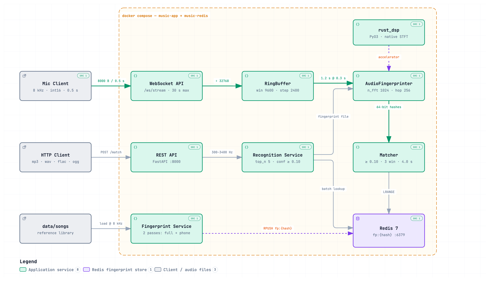
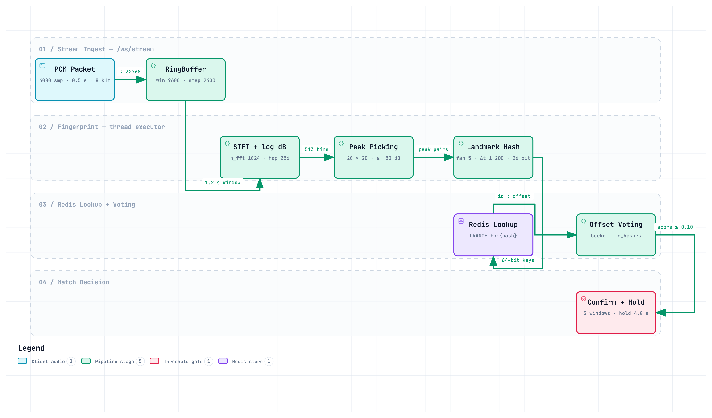

# Shazam-Style Audio Fingerprinting System

A real-time Python implementation of Shazam-style audio fingerprinting. Identifies songs from a live microphone stream in under 5 seconds using spectral peak detection, anchor-target constellation mapping, offset-alignment voting, consensus gating, and temporal smoothing — robust to background noise and telephone-quality audio.

## 📋 Table of Contents

- [Overview](#-overview)
- [Why Preprocessing?](#-why-does-audio-need-preprocessing)
- [Project Structure](#-project-structure)
- [Quick Start](#-quick-start)
- [System Architecture](#-system-architecture)
  - [Diagrams](#diagrams)
- [Real-Time Streaming Pipeline](#-real-time-streaming-pipeline)
- [Scripts Reference](#-scripts-reference)
- [Configuration](#-configuration)
- [Evaluation](#-evaluation)
- [Robustness](#-robustness-features)
- [Docker Setup](#-docker-setup)
- [References](#-references)

## 🎯 Overview

This system implements industry-standard Shazam-style audio fingerprinting featuring:

- **Audio Preprocessing**: Mono conversion, resampling to 8 kHz, DC removal, amplitude normalisation, optional bandpass filtering (phone mode)
- **Spectral Analysis**: STFT with configurable FFT size and hop length
- **Peak Detection**: Local maxima via `maximum_filter` with percentile-based amplitude thresholding
- **64-bit Fingerprint Hashing**: Anchor-target pairing packed as `[f1·9-bit][f2·9-bit][Δt·8-bit]`
- **Redis Fingerprint Store**: Hash lists at `fp:{hash_value}` keys; single pipeline round-trip per query
- **Offset-Alignment Voting**: Time-invariant matching robust to recording offset
- **Real-Time WebSocket Streaming**: Live microphone → server over `/ws/stream`; int16 wire encoding (half the bandwidth of float32)
- **Ring-Buffer Windowing**: Pre-allocated numpy ring buffer; zero-copy window views, O(1) slide
- **Consensus Voting**: Requires the same song to win 3 successive windows before confirming — eliminates single-window false positives
- **Temporal Smoothing**: Holds the last confirmed song for 4 seconds across brief fingerprint dropout windows
- **Playback Offset**: Reports the position in the original song (minutes:seconds) where the matched audio was recorded
- **30-Second Timeout**: Server and client both abandon the session gracefully after 30 s without a confirmed match
- **Parameter Tuning**: Grid-search script to find optimal fingerprinter parameters

---

## 🔥 Why Does Audio Need Preprocessing?

Real-world audio recordings are rarely clean. Noise and distortion are introduced at multiple stages of the recording chain.

| Source | Description |
|---|---|
| **Cheap Microphones** | Low-quality capsules introduce self-noise and frequency coloration |
| **ADC Imperfections** | Quantization noise, clipping, and non-linearity errors during analog → digital conversion |
| **Recording Devices** | Power supply hum (50/60 Hz), poor shielding bleed into the signal |
| **Compression Artifacts** | Lossy codecs (MP3, AAC) discard high-frequency detail and introduce ringing artifacts |
| **Telephone / GSM Channels** | Band-limited to 300–3400 Hz, heavily compressed, low bitrate |

### 🛠️ How Preprocessing Fixes This

1. **Mono Conversion** — Collapses stereo to a single channel; eliminates channel imbalance.
2. **Resampling to 8000 Hz** — Standardises the sample rate; 8 kHz captures up to 4 kHz — sufficient for telephone-quality fingerprinting.
3. **Amplitude Normalisation** — Scales peak amplitude to ±1; removes recording level differences.
4. **DC Removal** — Subtracts the mean; eliminates DC offset from cheap ADCs.
5. **Pre-emphasis** — Boosts high-frequency energy to compensate for spectral roll-off.
6. **Bandpass Filter (phone mode)** — 4th-order Butterworth 300–3400 Hz; simulates telephone/GSM channel conditions.
7. **Percentile Peak Thresholding** — Retains only the top 15% of spectral energy peaks as landmarks.

---

## 📁 Project Structure

```
music-detection/
├── app/
│   ├── main.py                # FastAPI app + uvicorn entry point
│   ├── config.py              # All tuneable constants (SAMPLE_RATE, WINDOW_SIZE, etc.)
│   ├── api/
│   │   ├── routes.py          # HTTP routes
│   │   └── websocket.py       # /ws/stream WebSocket endpoint
│   ├── core/
│   │   ├── fingerprint.py     # AudioFingerprinter — preprocess, spectrogram, peaks, hashes
│   │   ├── matcher.py         # bandpass, match_sample, fingerprint_only, score_matches,
│   │   │                      #   match_audio, ConsensusVoter, SongTracker, matcher_worker
│   │   ├── buffer.py          # RingBuffer — pre-allocated sliding-window ring buffer
│   │   └── streaming.py       # Microphone audio producer (CLI streaming path)
│   ├── db/
│   │   ├── redis.py           # Redis connection helper
│   │   └── fingerprint_repo.py  # match_fingerprints_bulk — pipeline batch query
│   ├── models/
│   │   ├── song.py            # Song model
│   │   └── response.py        # API response models
│   ├── services/
│   │   ├── fingerprint_service.py
│   │   └── recognition_service.py
│   └── utils/
│       ├── audio.py
│       └── logging.py         # get_logger helper
├── scripts/
│   ├── client.py              # WebSocket microphone client (uv run client)
│   ├── insert_songs.py        # Register songs in Redis
│   ├── fingerprint_songs.py   # Compute & store fingerprints
│   ├── create_samples.py      # Generate clean + noisy test clips
│   ├── match_song.py          # Match a single audio file
│   ├── evaluate_system.py     # Batch evaluation across clean/noisy samples
│   ├── tune_params.py         # Grid-search parameter tuning
│   ├── stream_audio.py        # CLI microphone streaming (non-WebSocket path)
│   └── drop_tables.py         # Reset Redis fingerprint store
├── data/
│   ├── songs/                 # Full-length audio files (MP3/WAV/FLAC/OGG)
│   ├── samples/               # Clean test clips
│   ├── samples_noisy/         # Gaussian-noisy variants
│   └── test/                  # Manual test files
├── experiments/
│   ├── experiment.ipynb
│   └── toy_example.ipynb
├── docker-compose.yml
├── pyproject.toml
└── requirements.txt
```

---

## 🚀 Quick Start

### Prerequisites

- **Python 3.10+** and **uv** (`pip install uv`)
- **Redis** running on `localhost:6379` (or via Docker)
- Audio files placed in `data/songs/`

### Setup

```bash
# Install dependencies
uv sync

# Start Redis (if using Docker)
docker compose up -d redis
```

### Full Pipeline (run in order)

```bash
# 1. Register song names in Redis
uv run python scripts/insert_songs.py

# 2. Compute and store fingerprints
uv run python scripts/fingerprint_songs.py

# 3. Start the server
uv run app-main
# or: uv run -m app.main

# 4. In another terminal — stream from microphone
uv run client
# or: uv run python scripts/client.py
```

---

## 🏗️ System Architecture

### Diagrams

Both diagrams are generated from checked-in specs under [`docs/`](docs/) and carry the
real constants from `app/config.py` and `app/core/`. The PNGs below are static exports;
the `.html` files are self-contained interactive viewers (search, focus, relationship
tracing, guided walkthroughs, light/dark, PNG/SVG export) that open straight in a browser.

**High-level architecture** — components, boundaries, and the three request paths.
Interactive: [`docs/high-level-architecture.html`](docs/high-level-architecture.html)



- **Live streaming path** — Mic Client → WebSocket API → RingBuffer → AudioFingerprinter → Matcher → Redis
- **File upload path** — HTTP Client → REST API → Recognition Service → Redis
- **Offline indexing** — `data/songs` → Fingerprint Service → Redis (two passes per song: broadband + 300–3400 Hz phone band)
- `rust_dsp` is shown dashed: an optional PyO3 accelerator for STFT and hash generation
- Everything inside the dashed boundary runs under `docker compose` (`music-app` + `music-redis`)

**Low-level window pipeline** — what happens to a single 1.2 s window, lane by lane.
Interactive: [`docs/low-level-pipeline.html`](docs/low-level-pipeline.html)



Every box carries its governing constant, so the diagram doubles as a tuning reference:
packet `4000 smp / 0.5 s` → buffer `win 9600 · step 2400` → STFT `n_fft 1024 · hop 256`
→ peaks `20 × 20 · ≥ −50 dB` → hashes `fan 5 · Δt 1–200 · 26 bit` → `LRANGE fp:{hash}`
→ voting `bucket ÷ n_hashes` → confirm `3 windows · hold 4.0 s`.

<details>
<summary>Regenerating the diagrams</summary>

The specs are `docs/high-level.architecture.json` and `docs/low-level.workflow.json`.
They are rendered with [archify](https://github.com/tt-a1i/archify):

```bash
archify deliver architecture docs/high-level.architecture.json docs/high-level-architecture.html \
  --quality showcase --repo-root .
archify deliver workflow docs/low-level.workflow.json docs/low-level-pipeline.html \
  --quality showcase
```

The architecture spec pins source-file references to a commit, so `--repo-root` is
required and the pinned revision in `meta.repository` must be updated when those line
ranges move. The PNGs under `docs/images/` are screenshots of the rendered HTML.

</details>

### Core Modules

| Module | Responsibility |
|---|---|
| `app/core/fingerprint.py` | `AudioFingerprinter` — preprocess audio, STFT spectrogram, peak detection, 64-bit landmark hashes |
| `app/core/matcher.py` | `fingerprint_only`, `score_matches`, `match_audio`, `ConsensusVoter`, `SongTracker`, `matcher_worker` |
| `app/core/buffer.py` | `RingBuffer` — pre-allocated sliding-window ring buffer, zero-copy window views |
| `app/db/fingerprint_repo.py` | `match_fingerprints_bulk` — Redis pipeline batch query |
| `app/api/websocket.py` | `/ws/stream` WebSocket endpoint — full real-time pipeline |
| `scripts/client.py` | Microphone WebSocket client with live status display |

### Data Flow

```
 INDEXING (offline)
 ──────────────────────────────────────────────────
  data/songs/*.mp3/wav
        │
        ▼
  AudioFingerprinter     preprocess → spectrogram → peaks → hashes
        │
        ▼
  Redis                  RPUSH fp:{hash_value} "{song_id}:{time_offset}"


 REAL-TIME STREAMING (per connection)
 ──────────────────────────────────────────────────
  Microphone (int16, 8 kHz, 0.5 s packets)
        │  WebSocket binary frames
        ▼
  RingBuffer             sliding windows (1.2 s / 0.3 s step)
        │  window (9600 samples)
        ▼
  fingerprint_only       STFT → peaks → hashes          [thread executor]
        │  hashes
        ▼
  match_fingerprints_bulk  Redis pipeline round-trip     [thread executor]
        │  db_rows
        ▼
  score_matches          offset-alignment voting → (best_id, confidence, offset_bins)
        │
        ▼
  ConsensusVoter         require 3 windows to agree → confirmed result
        │
        ▼
  SongTracker            hold confirmed song for 4 s across dropout windows
        │
        ▼
  WebSocket JSON         {"matched": true, "name": "...", "confidence": 0.23,
                          "offset_s": 34.56, "timestamp": "14:05:01"}
```

---

## 🎙 Real-Time Streaming Pipeline

### Wire Protocol

| Direction | Format | Detail |
|---|---|---|
| Client → Server | Binary | int16 LE PCM, mono, 8 kHz, 0.5 s / frame |
| Server → Client | UTF-8 JSON | One message per processed window |

### Server Response Messages

```jsonc
// No match yet
{"matched": false}

// 30-second timeout
{"matched": false, "reason": "timeout"}

// Confirmed match
{
  "matched":    true,
  "name":       "Song Title",
  "confidence": 0.23,     // average confidence over confirming windows
  "offset_s":   34.56,    // playback position in original song (seconds)
  "timestamp":  "14:05:01"
}
```

### Detection Latency

With default settings, the first confirmed match can arrive as early as:

| Stage | Time |
|---|---|
| Buffer fills first window | ~1.2 s |
| 3 consensus windows (×0.3 s step) | +0.9 s |
| Fingerprint + Redis per window | ~0.2–0.5 s |
| **Typical time-to-match** | **~3–5 s** |

### Client Output

```
Connected to ws://localhost:8000/ws/stream
Listening via microphone — 0.5s packets at 8000 Hz
Will give up after 30s without a match.

Listening…  8.5s elapsed  (22s remaining)

MATCH → thee_koluthi  confidence=0.183  offset=1m24.32s  14:05:01
Done — 17 packets sent
```

---

## 📜 Scripts Reference

### `scripts/client.py`
WebSocket microphone client. Streams int16 PCM from the system microphone, prints a live status line, and exits immediately on match or after 30 s.

```bash
uv run client
```

### `scripts/insert_songs.py`
Scans `data/songs/` for audio files and registers each name in Redis. Safe to re-run — skips duplicates.

```bash
uv run python scripts/insert_songs.py
```

### `scripts/fingerprint_songs.py`
For each registered song, computes fingerprints and stores hash lists in Redis.

```bash
uv run python scripts/fingerprint_songs.py
```

### `scripts/create_samples.py`
Generates short test clips from each song — clean and Gaussian-noisy variants.

| Setting | Value |
|---|---|
| Clip duration | 4 seconds |
| Clips per song | 10 |
| Sample rate | 8000 Hz |
| Noise levels | light (SNR +10 dB), medium (SNR 0 dB), heavy (SNR −5 dB) |

```bash
uv run python scripts/create_samples.py
```

### `scripts/match_song.py`
Match a single audio file against the fingerprint store.

```bash
uv run python scripts/match_song.py data/test/thee_koluthi.wav
```

### `scripts/evaluate_system.py`
Batch evaluation across all clean and noisy samples. Reports Top-1 accuracy, Top-3 accuracy, and no-match rate per noise level.

```bash
uv run python scripts/evaluate_system.py
```

### `scripts/tune_params.py`
Grid-search over fingerprinter parameters.

```bash
uv run python scripts/tune_params.py
```

### `scripts/drop_tables.py`
Clears all fingerprint data from Redis (requires confirmation).

```bash
uv run python scripts/drop_tables.py
```

---

## 🔧 Configuration

All constants live in `app/config.py` and can be overridden with environment variables.

### Audio / Streaming

| Parameter | Default | Description |
|---|---|---|
| `SAMPLE_RATE` | 8000 Hz | Wire and processing sample rate |
| `PACKET_DURATION` | 0.5 s | Client packet length |
| `WINDOW_DURATION` | 1.2 s | Fingerprinting window length |
| `STEP_DURATION` | 0.3 s | Sliding window step |
| `PACKET_SIZE` | 4000 samples | `SAMPLE_RATE × PACKET_DURATION` |
| `WINDOW_SIZE` | 9600 samples | `SAMPLE_RATE × WINDOW_DURATION` |
| `STEP_SIZE` | 2400 samples | `SAMPLE_RATE × STEP_DURATION` |
| `MIN_CONFIDENCE` | 0.1 | Minimum normalised confidence to accept a match |

### Fingerprinter (`AudioFingerprinter`)

| Parameter | Default | Description |
|---|---|---|
| `n_fft` | 1024 | STFT window size |
| `hop_length` | 256 | STFT hop (frame step) |
| `fan_value` | 10 | Target peaks per anchor |
| `target_zone_time` | 50 | Max frame gap anchor→target |

### Matching / Streaming

| Parameter | Default | Description |
|---|---|---|
| `ConsensusVoter.threshold` | 3 | Windows required to confirm a match |
| `SongTracker.hold_time` | 4.0 s | Seconds to hold a song across dropout windows |
| `MAX_STREAM_TIME` | 30 s | Hard server timeout per connection |
| `LISTEN_TIMEOUT` | 30 s | Hard client timeout |

### Bandpass Filter

| Parameter | Value |
|---|---|
| Filter type | 4th-order Butterworth |
| Low cutoff | 300 Hz |
| High cutoff | 3400 Hz |
| Applied when | `is_phone_mode=True` |

---

## 📊 Evaluation

### Matching Algorithm

1. **Ring-buffer windowing** — overlapping 1.2 s windows slide every 0.3 s
2. **Fingerprint** — STFT → log-magnitude spectrogram → peak detection → 64-bit hashes
3. **Redis batch query** — all hashes fetched in one pipeline round-trip
4. **Offset-alignment voting** — `votes[song_id][db_offset − query_offset] += 1`; position-invariant
5. **Score normalisation** — `confidence = peak_votes / total_query_hashes`
6. **Consensus gate** — same song must win 3 windows
7. **Temporal smoothing** — song held for 4 s across dropout windows
8. **Playback offset** — `offset_s = offset_bins × hop_length / sample_rate`

### Expected Performance

| Condition | Top-1 Accuracy |
|---|---|
| Clean samples | ~95–100% |
| Light noise (SNR +10 dB) | ~90–98% |
| Medium noise (SNR 0 dB) | ~75–90% |
| Heavy noise (SNR −5 dB) | ~50–75% |

---

## 🔐 Robustness Features

- ✅ Volume changes — amplitude normalisation before hashing
- ✅ Recording offset — offset-alignment voting is position-independent
- ✅ Compression artifacts — high fan-out creates overlapping, redundant hashes
- ✅ Background noise — percentile thresholding retains only dominant spectral peaks
- ✅ Device/sample-rate variation — all audio resampled to 8000 Hz
- ✅ Telephone/GSM channels — bandpass mode + `--phone-mode` query path
- ✅ False positives — consensus voting requires 3 agreeing windows
- ✅ Dropout windows — temporal smoothing holds the song for 4 s
- ✅ Event-loop blocking — CPU and Redis work run in thread executors
- ✅ Bandwidth — int16 wire encoding halves bytes vs float32

---

## 🐳 Docker Setup

```bash
# Start Redis + app
docker compose up

# Or start Redis only and run the app locally
docker compose up -d redis
uv run app-main
```

---

## 📚 References

- Wang, A. (2003). *An Industrial-Strength Audio Search Algorithm.* Shazam Entertainment.
- Librosa documentation: https://librosa.org/
- STFT: https://en.wikipedia.org/wiki/Short-time_Fourier_transform

---

## 📄 License

Educational project — S4 MFC Course.


## 📋 Table of Contents

- [Overview](#-overview)
- [Why Preprocessing?](#-why-does-audio-need-preprocessing)
- [Project Structure](#-project-structure)
- [Quick Start](#-quick-start)
- [Pipeline](#-pipeline)
- [Scripts Reference](#-scripts-reference)
- [Configuration](#-configuration)
- [Evaluation](#-evaluation)
- [Robustness](#-robustness-features)
- [Docker Setup](#-docker-setup)
- [References](#-references)

## 🎯 Overview

This system implements industry-standard Shazam-style audio fingerprinting featuring:

- **Audio Preprocessing**: Mono conversion, resampling to 8000 Hz, DC removal, amplitude normalisation, optional bandpass filtering (phone mode)
- **Spectral Analysis**: STFT with configurable FFT size and hop length
- **Peak Detection**: Local maxima via `maximum_filter` with percentile-based amplitude thresholding
- **64-bit Fingerprint Hashing**: Anchor-target pairing packed as `[f1·9-bit][f2·9-bit][Δt·8-bit]`
- **Dual Hash Indexing**: Each song is stored with both broadband and phone-mode (300–3400 Hz bandpass) hashes for robust telephone/GSM matching
- **SQLite Database**: Songs table + fingerprints table with `idx_hash` index for fast lookups
- **Offset-Alignment Voting**: Time-invariant matching robust to recording offset
- **Score Normalisation & Thresholding**: Confidence scores (0–1) with rejection below threshold
- **Live Microphone Matching**: Real-time stream matching via `stream_audio.py`
- **Parameter Tuning**: Grid-search script to find optimal fingerprinter parameters

---

## 🔥 Why Does Audio Need Preprocessing?

Real-world audio recordings are rarely clean. Noise and distortion are introduced at multiple stages of the recording chain. Common sources include:

| Source | Description |
|---|---|
| **Cheap Microphones** | Low-quality capsules introduce self-noise and frequency coloration |
| **ADC Imperfections** | Quantization noise, clipping, and non-linearity errors during analog → digital conversion |
| **Recording Devices** | Power supply hum (50/60 Hz), poor shielding bleed into the signal |
| **Compression Artifacts** | Lossy codecs (MP3, AAC) discard high-frequency detail and introduce ringing artifacts |
| **Telephone / GSM Channels** | Band-limited to 300–3400 Hz, heavily compressed, low bitrate |

### 🛠️ How Preprocessing Fixes This

1. **Mono Conversion** — Collapses stereo to a single channel; eliminates channel imbalance.
2. **Resampling to 8000 Hz** — Standardises the sample rate; 8 kHz captures up to 4 kHz — sufficient for telephone-quality fingerprinting.
3. **Amplitude Normalisation** — Scales peak amplitude to ±1; removes recording level differences.
4. **DC Removal** — Subtracts the mean; eliminates DC offset from cheap ADCs.
5. **Pre-emphasis** — Boosts high-frequency energy to compensate for spectral roll-off.
6. **Bandpass Filter (phone mode)** — 4th-order Butterworth 300–3400 Hz; simulates telephone/GSM channel conditions.
7. **Percentile Peak Thresholding** — Retains only the top 15% of spectral energy peaks as landmarks.

---

## 📁 Project Structure

```
music-detection/
├── fingerprint.py             # AudioFingerprinter class (preprocess, spectrogram, peaks, hashes, tune_parameters)
├── matcher.py                 # bandpass() filter + match_sample()
├── database.py                # SQLite helpers (create, insert, bulk match)
├── experiment.ipynb           # Interactive exploration notebook
├── toy_example.ipynb          # Minimal worked example
├── requirements.txt           # Python dependencies
├── Dockerfile                 # Docker configuration
├── README.md                  # This file
├── scripts/
│   ├── insert_songs.py        # Register songs from songs/ into the DB
│   ├── fingerprint_songs.py   # Compute & store fingerprints (broadband + phone-mode)
│   ├── create_samples.py      # Generate clean + Gaussian-noisy test clips
│   ├── generate_audio_variations.sh  # GSM & low-bitrate MP3 conversion of samples
│   ├── match_song.py          # Match a single audio file (supports --phone-mode)
│   ├── evaluate.py            # Batch evaluation across clean and noisy samples
│   ├── tune_params.py         # Grid-search parameter tuning
│   ├── stream_audio.py        # Real-time microphone matching
│   ├── process_variation.sh   # Process a single audio variation
│   └── drop_tables.py         # Drop all DB tables (reset)
├── songs/                     # Full-length audio files (MP3/WAV/FLAC/OGG)
│   ├── SongName.mp3
│   ├── samples/               # Clean 4s WAV clips
│   ├── samples_noisy/         # Gaussian-noisy variants (light / medium / heavy)
│   ├── gsm/
│   │   ├── samples/           # GSM-encoded clean clips
│   │   └── samples_noisy/     # GSM-encoded noisy clips
│   ├── low_mp3/
│   │   ├── samples/           # 64 kbps MP3 clean clips
│   │   └── samples_noisy/     # 64 kbps MP3 noisy clips
│   └── test/                  # Manual test files
└── database/
    └── fingerprints.db        # SQLite database (auto-created, git-ignored)
```

---

## 🚀 Quick Start

### Prerequisites

- **Python 3.10+** (or Docker)
- **ffmpeg** — required for GSM/MP3 conversion (`brew install ffmpeg`)
- Audio files placed in `songs/` (MP3, WAV, FLAC, OGG)

### Local Setup

```bash
# Create and activate virtual environment
python3 -m venv env
source env/bin/activate

# Install dependencies
pip install -r requirements.txt
```

### Full Pipeline (run in order)

```bash
# 1. Register song names in the database
python scripts/insert_songs.py

# 2. Compute and store fingerprints (broadband + phone-mode hashes per song)
python scripts/fingerprint_songs.py

# 3. Generate test clips (clean + Gaussian-noisy variants)
python scripts/create_samples.py

# 4. (Optional) Generate GSM and low-bitrate MP3 variations
bash scripts/generate_audio_variations.sh

# 5. Match a single clip
python scripts/match_song.py songs/samples/SongName_sample_2.wav

# 5a. Match a telephone/GSM recording
python scripts/match_song.py songs/gsm/samples/SongName_sample_2.gsm --phone-mode

# 6. Evaluate the whole system
python scripts/evaluate.py

# 7. (Optional) Tune parameters via grid search
python scripts/tune_params.py
```

---

## 🏗️ System Architecture

The system is built around three core Python modules. Scripts in `scripts/` are thin orchestration wrappers that wire these modules together.

### Module Responsibilities

| Module | Responsibility |
|---|---|
| `fingerprint.py` | `AudioFingerprinter` class — preprocess audio, build spectrogram, detect spectral peaks, produce 64-bit landmark hashes |
| `matcher.py` | `bandpass()` filter (phone mode) + `match_sample()` — hash lookup in SQLite and offset-alignment voting to identify a song |
| `database.py` | SQLite helpers — create tables, insert songs/fingerprints, bulk hash queries |

### Two Operating Paths

```
 INDEXING (run once, offline)
 ──────────────────────────────────────────────────────────
  songs/*.mp3/wav
       │
       ▼
  fingerprint.py         preprocess → spectrogram → peaks → hashes
  (AudioFingerprinter)   run twice per song: broadband + phone-mode
       │
       ▼
  database.py            INSERT INTO fingerprints (song_id, hash_value, time_offset)
       │
       ▼
  database/fingerprints.db   (idx_hash index for fast lookup)


 QUERYING (real-time / batch)
 ──────────────────────────────────────────────────────────
  audio clip / microphone
       │
       ▼
  fingerprint.py         same pipeline as indexing
       │  hashes
       ▼
  matcher.py             batch SELECT WHERE hash_value IN (...)
                         offset-alignment voting → confidence score
       │
       ▼
  Ranked results         [(song_name, confidence), ...]
```

### Detailed Data Flow

```
Audio File / Mic Stream
        │
        ▼
┌─────────────────────────┐
│  preprocess()           │  mono · resample 8 kHz · normalise · DC-remove
│  fingerprint.py         │  · pre-emphasis · [phone mode: bandpass 300–3400 Hz]
└────────────┬────────────┘
             │  waveform y
             ▼
┌─────────────────────────┐
│  generate_spectrogram() │  STFT  →  |magnitude|  →  log dB
│  fingerprint.py         │
└────────────┬────────────┘
             │  S_db  (freq × time matrix)
             ▼
┌─────────────────────────┐
│  find_peaks()           │  maximum_filter (20×20 neighbourhood)
│  fingerprint.py         │  → local maxima · percentile threshold (top 15%)
└────────────┬────────────┘
             │  peaks  [(freq_idx, time_idx), ...]
             ▼
┌─────────────────────────┐
│  generate_hashes()      │  anchor-target pairing  →  packed 64-bit hash
│  fingerprint.py         │  hash = [f1 · 9-bit][f2 · 9-bit][Δt · 8-bit]
└────────────┬────────────┘
             │  hashes  [(hash_value, time_offset), ...]
             │
      ┌──────┴──────┐
      │             │
  (indexing)    (querying)
      │             │
      ▼             ▼
 database.py   match_sample()          batch IN(...) query
  INSERT         matcher.py        →   votes[song_id][db_t − query_t] += 1
                                   →   confidence = peak_votes / n_hashes
                                   →   discard if confidence < MIN_CONFIDENCE
                                   →   ranked [(song_name, confidence), ...]
```

---

## 📜 Scripts Reference

### `scripts/insert_songs.py`
Scans `songs/` for audio files and inserts each song name into the `songs` table. Safe to re-run — skips duplicates.

```bash
python scripts/insert_songs.py
```

---

### `scripts/fingerprint_songs.py`
For each song in the DB, computes **two sets of hashes** and stores both:
- **Broadband hashes** — standard preprocessing
- **Phone-mode hashes** — with 300–3400 Hz bandpass (simulates telephone/GSM)

Skips songs already fingerprinted.

```bash
python scripts/fingerprint_songs.py
```

---

### `scripts/create_samples.py`
Generates short test clips from each song in `songs/`. The song is divided into `N_SAMPLES` equal segments with a random offset within each, ensuring clips are spread across the full duration.

| Setting | Value |
|---|---|
| Clip duration | 4 seconds |
| Clips per song | 10 |
| Sample rate | 8000 Hz |
| Noise type | Gaussian noise |
| Noise levels | light (SNR +10 dB), medium (SNR 0 dB), heavy (SNR −5 dB) |

```bash
python scripts/create_samples.py
```

Output:
- `songs/samples/SongName_sample_N.wav` — clean clips
- `songs/samples_noisy/SongName_sample_N_light.wav` — light noise
- `songs/samples_noisy/SongName_sample_N_medium.wav` — medium noise
- `songs/samples_noisy/SongName_sample_N_heavy.wav` — heavy noise

---

### `scripts/generate_audio_variations.sh`
Runs `create_samples.py` first, then converts all clips to GSM and low-bitrate MP3 formats using ffmpeg.

```bash
bash scripts/generate_audio_variations.sh
```

Output:
- `songs/gsm/samples/` — GSM-encoded (8 kHz, 13 kbps) clean clips
- `songs/gsm/samples_noisy/` — GSM-encoded noisy clips
- `songs/low_mp3/samples/` — 64 kbps MP3 clean clips
- `songs/low_mp3/samples_noisy/` — 64 kbps MP3 noisy clips

---

### `scripts/match_song.py`
Match a single audio file against the fingerprint database.

```bash
python scripts/match_song.py <path_to_audio> [--phone-mode]

# Examples
python scripts/match_song.py songs/samples/Neelothi_sample_2.wav
python scripts/match_song.py songs/samples_noisy/Neelothi_sample_3_heavy.wav --phone-mode
python scripts/match_song.py songs/gsm/samples/Neelothi_sample_2.gsm --phone-mode
```

`--phone-mode` applies the 300–3400 Hz bandpass filter before fingerprinting, matching against the phone-mode hashes stored in the DB.

Output:
```
Query      : songs/samples/Neelothi_sample_2.wav
Phone mode : OFF
DB         : database/fingerprints.db

Hashes generated : 2847
Matches found    : 3

  Rank   Song                                Confidence
  -------------------------------------------------------
  1      Neelothi                                0.1823  <-- BEST MATCH
  2      Cheenikkallu                            0.0031
  3      Mannichiru                              0.0021
```

---

### `scripts/evaluate.py`
Batch evaluation across all clean and noisy samples. Reports Top-1 accuracy, Top-3 accuracy, and no-match rate per noise level with a final comparison table.

```bash
python scripts/evaluate.py
```

Output sections:
- **CLEAN SAMPLES** — baseline accuracy
- **NOISY SAMPLES — LIGHT** — Gaussian noise SNR +10 dB
- **NOISY SAMPLES — MEDIUM** — Gaussian noise SNR 0 dB
- **NOISY SAMPLES — HEAVY** — Gaussian noise SNR −5 dB
- **OVERALL COMPARISON** — side-by-side accuracy table

---

### `scripts/tune_params.py`
Grid-search over fingerprinter parameters to find the best combination for a given probe set.

```bash
# Full grid on all splits
python scripts/tune_params.py

# Clean split only, show top-3 combos
python scripts/tune_params.py --split clean --top 3

# Noisy splits, limit probes for a quick run
python scripts/tune_params.py --split light medium --max-probes 20

# Custom grid
python scripts/tune_params.py --fan-values 10 15 20 --delta-t-max 150 200 --min-conf 0.01 0.02
```

Default grid:

| Parameter | Values searched |
|---|---|
| `fan_value` | 5, 10, 15, 20 |
| `delta_t_max` | 100, 200, 300 |
| `freq_bin_size` | 5, 10 |
| `min_confidence` | 0.01, 0.02, 0.05 |

---

### `scripts/stream_audio.py`
Continuously captures audio from the microphone in 4-second chunks and matches each chunk against the DB in a background thread.

```bash
python scripts/stream_audio.py
```

- Prints `...` for each chunk with no match
- Prints a result card when a song is identified and keeps listening
- Press `s` + Enter to stop

Output on match:
```
==================================================
  🎵  SONG IDENTIFIED
==================================================
  Name       : Neelothi
  Confidence : 0.087
  Chunks     : processed until match
==================================================
```

---

### `scripts/drop_tables.py`
Drops all tables in the database (requires manual confirmation). Use to reset and re-run the pipeline from scratch.

```bash
python scripts/drop_tables.py
# → Type 'yes' to confirm
```

---

## 🔧 Configuration

### `AudioFingerprinter` defaults (`fingerprint.py`)

| Parameter | Default | Description |
|---|---|---|
| `sample_rate` | 8000 Hz | Target sample rate |
| `n_fft` | 2048 | STFT window size |
| `hop_length` | 512 | STFT hop (frame step) |
| `fan_value` | 10 | Target peaks per anchor |
| `delta_t_min` | 1 | Min frame gap anchor→target |
| `delta_t_max` | 200 | Max frame gap |
| `freq_bin_size` | 10 | Frequency quantisation |

### Matching defaults (`evaluate.py`, `match_song.py`)

| Parameter | Default | Description |
|---|---|---|
| `MIN_CONFIDENCE` | 0.02 | Reject matches below this normalised score |
| `TOP_N` | 5 | Number of candidates returned |

### Bandpass filter (`matcher.py`)

| Parameter | Value |
|---|---|
| Filter type | 4th-order Butterworth |
| Low cutoff | 300 Hz |
| High cutoff | 3400 Hz |
| Applied when | `is_phone_mode=True` |

---

## 📊 Evaluation

### Matching Algorithm

1. **Batch DB query** — all query hashes fetched in a single `WHERE hash_value IN (...)` call
2. **Offset-alignment voting** — `votes[song_id][db_offset − query_offset] += 1`; robust to where in the song the clip was taken
3. **Score normalisation** — `confidence = peak_votes / total_query_hashes` → comparable 0–1 scale
4. **Thresholding** — results below `MIN_CONFIDENCE` are discarded as no-match

### Expected Performance

| Condition | Top-1 Accuracy |
|---|---|
| Clean samples | ~95–100% |
| Light noise (SNR +10 dB) | ~90–98% |
| Medium noise (SNR 0 dB) | ~75–90% |
| Heavy noise (SNR −5 dB) | ~50–75% |

---

## 🔐 Robustness Features

- ✅ Volume changes — amplitude normalisation before hashing
- ✅ Recording offset — offset-alignment voting is position-independent
- ✅ Compression artifacts — high fan-out creates overlapping, redundant hashes
- ✅ Background noise — percentile thresholding retains only dominant spectral peaks
- ✅ Device/sample-rate variation — all audio resampled to 8000 Hz
- ✅ Telephone/GSM channels — dual hash indexing (broadband + bandpass) + `--phone-mode` query path

---

## 🐳 Docker Setup

```bash
# Build
docker build -t music-detection .

# Run Jupyter Lab
docker run -p 8888:8888 -v $(pwd):/workspace music-detection
```

Access at: `http://localhost:8888`

---

## 📚 References

- Wang, A. (2003). *An Industrial-Strength Audio Search Algorithm.* Shazam Entertainment.
- Librosa documentation: https://librosa.org/
- STFT: https://en.wikipedia.org/wiki/Short-time_Fourier_transform

---

## 📄 License

Educational project — S4 MFC Course.

---

**Last Updated**: March 2026 · **Python**: 3.10+ · **Sample Rate**: 8000 Hz · **FFT Size**: 2048

